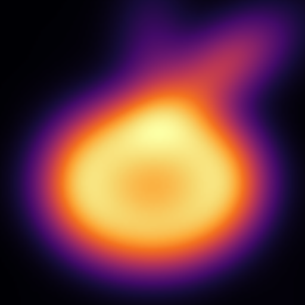
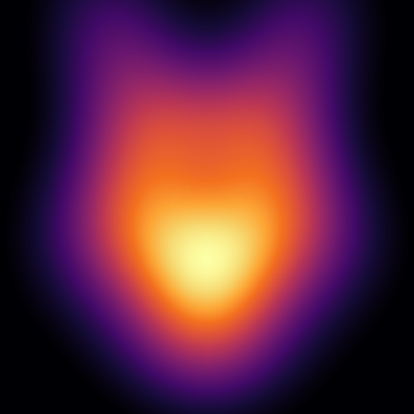
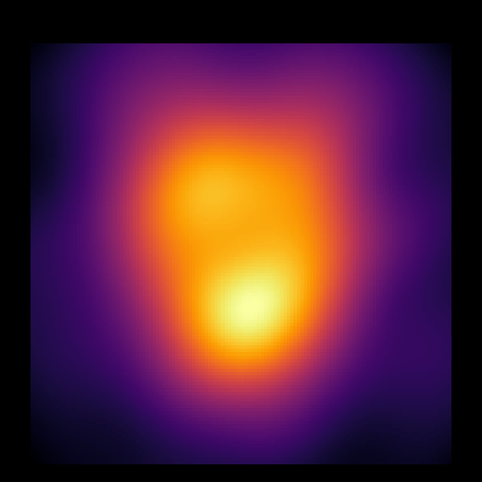
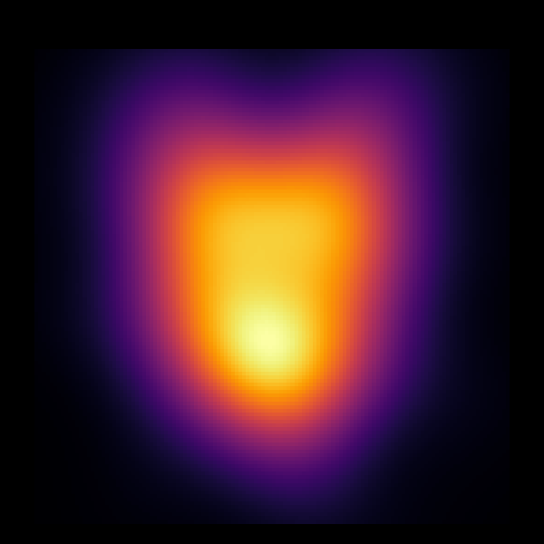
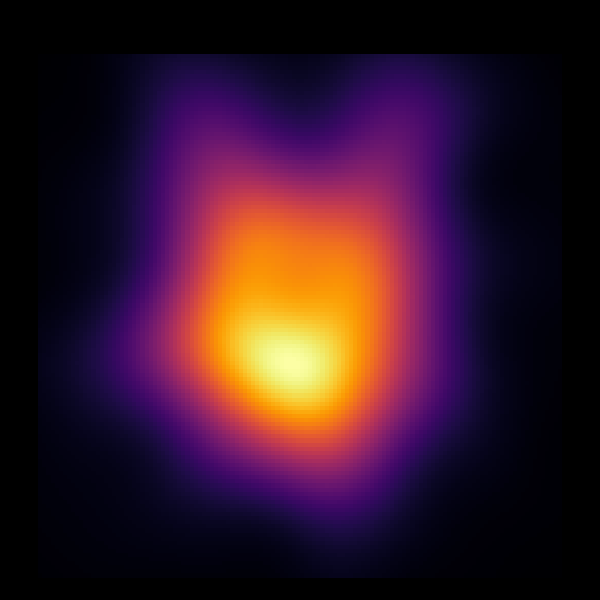

# Quantum CFS rendering

This repository reproduces part of the rendering method in Schloss and Usui's
paper, [General purpose graphical rendering on quantum devices with composable
function systems](https://www.leioslabs.com/publications/res/QCG_paper.pdf).
The paper's method is not mine. The additions here are an apple, a UConn wordmark
and a simplified husky assembled from the same Fock-state primitives and affine
operators.

<p align="center">
  
</p>
<p align="center">
  
  
</p>

## Method

An `N`-qubit register represents a harmonic oscillator truncated to `2^N`
Fock levels. Each component starts in a Fock state and is displaced, rotated or
squeezed. Full state tomography reconstructs its density matrix. The image is
the Husimi function of that matrix, and multi-part objects are weighted sums of
component images.

The MATLAB scripts use 4096 shots per tomography basis. The archived Kingston
run used four qubits, 81 bases and 512 shots per basis.

## MATLAB

The scripts require MATLAB's Support Package for Quantum Computing. They were
run with R2026a.

```sh
matlab -batch quantum_apple_qcg
matlab -batch qcg_glyphs
matlab -batch qcg_compose
matlab -batch qcg_husky_solo
```

The first two scripts perform the tomography. `qcg_compose.m` and
`qcg_husky_solo.m` only arrange and color the reconstructed images.

## Qiskit

```sh
python3 -m venv ibm/.venv
ibm/.venv/bin/pip install -r ibm/requirements.txt

# Noiseless Aer simulation; this is the default and needs no IBM account.
ibm/.venv/bin/python ibm/render.py

# Aer with a simple noise model derived from the archived Kingston calibration.
ibm/.venv/bin/python ibm/render.py --backend rehearse

# Submit to an IBM backend. This requires saved IBM Quantum credentials.
ibm/.venv/bin/python ibm/render.py --backend ibm --preparation state
```

`--preparation unitary` (the default) embeds each component's full unitary,
which is what the paper describes and what the first hardware run used.
`--preparation state` prepares the same target state directly, which cuts
the submitted circuits from 230-245 CZ gates to 23-29 and is the mode
worth using on hardware. `--dry-run` reports transpiled circuit sizes
without submitting, and `--component N` submits a single component as a
cheap pilot. Run `ibm/render.py --help` for the remaining options.

## Archived Kingston runs

Two hardware renders were submitted, both to ibm_kingston. The first, on
July 10, 2026, used the paper's unitary construction: 230-245 physical CZ
gates per circuit at Qiskit depths of 1028-1110, which came back with
component fidelities of 0.309-0.322. The second, the following night,
prepared the same five target states with `--preparation state`: 23-29 CZ
gates at submitted depths of 122-151, and the fidelities rose to
0.872-0.905.

<p align="center">
  
  
  
</p>
<p align="center"><i>left: simulation. middle: hardware, unitary circuits.
right: hardware, state-preparation circuits.</i></p>

The first image loses most of the ear detail and its component centers
drift toward the vacuum; that is consistent with amplitude damping over
the deep circuits, but these data do not separate damping from
preparation, correlated and tomography errors. The second run makes the
point from the other side: with roughly 9x fewer entangling gates there
is far less circuit to decay through, and the ears survive.

Two single-component pilots preceded the second render. State
preparation without twirling measured 0.899 on the muzzle; adding gate
twirling measured 0.846 on the same qubits minutes later. One paired
comparison, so no general conclusion about twirling, but it decided the
configuration for the full run.

A third run rendered the full eight-component 5-qubit husky, the same
scene as the simulation, by measuring all eight components at once on
eight disjoint five-qubit lines: one parallel tomography experiment,
split into four jobs to stay inside IBM's per-qubit instruction limit.
Component fidelities came out at 0.66-0.75, lower than the 4-qubit run
because these state preparations are roughly twice as deep; a
same-component screen put the cost of eight-way concurrency itself at
only about 0.04. The design, screening data and acceptance decisions are
in [`docs/parallel-5q-proposal.md`](docs/parallel-5q-proposal.md) and
[`run/`](run/); the whole sequence used 80 seconds of QPU time.

<p align="center">
  
  
</p>
<p align="center"><i>left: 5-qubit simulation. right: the same scene measured on
ibm_kingston, eight components in parallel.</i></p>

The raw counts, one submitted circuit from each job, runtime options,
calibration snapshot and reconstruction scripts are in [`run/`](run/). They can
be checked without an IBM account:

```sh
ibm/.venv/bin/python run/refit.py
ibm/.venv/bin/python run/rebuild_husky.py
ibm/.venv/bin/python run/plots.py
```

The rehearsal backend and the calibration-only fidelity estimate are deliberately
simple. They model independent gate and readout errors but not idle time,
coherence, crosstalk or drift, so neither should be treated as a prediction of a
future hardware run.

## References

- J. Schloss and A. Usui, *General purpose graphical rendering on quantum
  devices with composable function systems*.
- J. Schloss, *Composable function systems as a general-purpose rendering
  framework*.
- [MATLAB Support Package for Quantum Computing](https://www.mathworks.com/products/quantum-computing.html)
