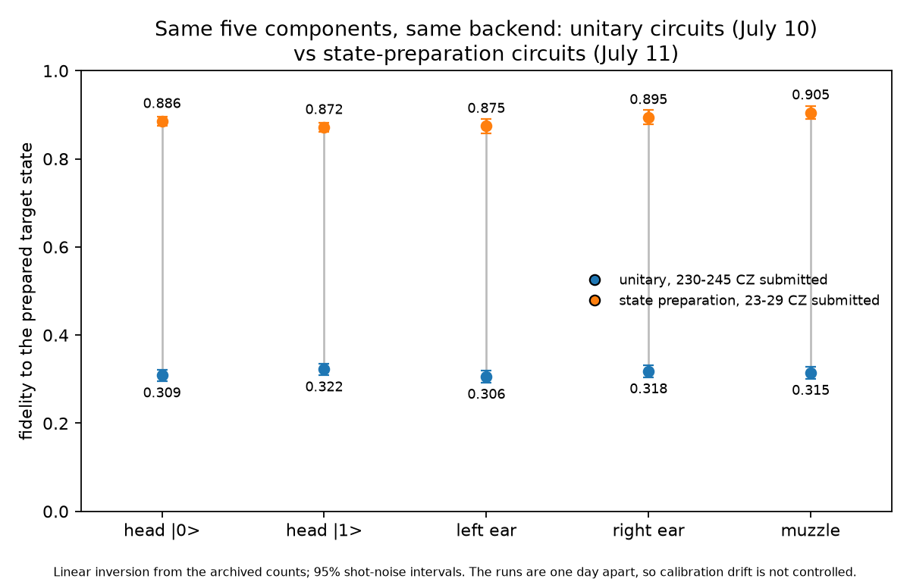

# Archived IBM run

This directory contains the data behind both `ibm_kingston` figures: the
July 10 render built from full unitaries (230-245 CZ per circuit, depths
1028-1110) and the July 11 render built from direct state preparation (23-29 CZ at
submitted depths of 122-151; the state-preparation stage alone is 17 CZ
before the tomography rotations and routing), plus the two single-component pilots that preceded
the second run. IBM job pages are visible only to the account that
submitted them, so the counts and representative transpiled circuits are
stored here.

| Path | Contents |
|---|---|
| `jobs.json` | Job IDs, timestamps, billed time, runtime options, measured qubits and representative circuit statistics |
| `counts/` | Counts for every tomography basis; `m_idx` uses 0=Z, 1=X and 2=Y |
| `circuits/` | OpenQASM 3 for basis 0 of each job; the remaining circuits differ in tomography-basis rotations |
| `calibration_ibm_kingston.json` | Calibration returned for the run time |
| `requirements-lock.txt` | Environment captured after submission |
| `states/` | Linear-inversion reconstructions generated by `refit.py` |
| `fetch.py` | Re-downloads the archive from the submitting IBM account |
| `refit.py` | Reconstructs density matrices from the committed counts |
| `rebuild_husky.py` | Rebuilds both hardware images from those matrices |
| `plots.py` | Regenerates the two diagnostic figures |

Run from the repository root:

```sh
ibm/.venv/bin/python run/refit.py
ibm/.venv/bin/python run/rebuild_husky.py
ibm/.venv/bin/python run/plots.py
```

The refit currently reports:

```text
job                    label                                 fidelity  purity
d98ra8af47jc73a896ng   single-component test (muzzle)           0.267   0.163
d98rg3if47jc73a89ct0   component 1: head |0>                    0.309   0.169
d98rgcgtcv6s73dmgbhg   component 2: head |1>                    0.322   0.171
d98rglgtcv6s73dmgbsg   component 3: left ear                    0.306   0.165
d98rgugtcv6s73dmgc60   component 4: right ear                   0.318   0.162
d98rh74qp3as739tajjg   component 5: muzzle                      0.315   0.164
d98sl4gtcv6s73dmhi60   state-prep pilot: muzzle                 0.899   0.833
d98smot2su3c739jmab0   state-prep pilot: muzzle, gate twirl     0.846   0.739
d98sngotcv6s73dmhkjg   state-prep 1: head |0>                   0.886   0.830
d98sno52su3c739jmb8g   state-prep 2: head |1>                   0.872   0.790
d98snvkqp3as739tbrr0   state-prep 3: left ear                   0.875   0.791
d98so6t2su3c739jmbog   state-prep 4: right ear                  0.895   0.837
d98sohcqp3as739tbsgg   state-prep 5: muzzle                     0.905   0.853
```

`rebuild_husky.py` reproduces both hardware images from the counts alone:
`husky_rebuilt.png` for the unitary run and `husky_rebuilt_v2.png` for the
state-preparation run. They match the published `output/husky_kingston*.png`
images up to the fitter difference described below.

`refit.py` uses linear inversion, so its density matrices can have small negative
eigenvalues. The live Qiskit analysis projected its fit onto the positive
semidefinite cone. That accounts for the small difference between the archived
linear-inversion values and the live values.

Two paired comparisons live in the pilots and should be read as indicative,
not as benchmarks. The no-DD test and the DD render muzzle from July 10
differ by about 0.05. The two state-prep pilots from July 11 differ by
about 0.05 in the other direction: gate twirling measured lower than no
twirling on the same qubits minutes apart, which is why the final render
ran without it.

## v3: the parallel 5-qubit render

Twelve further jobs (July 11, later that night) are archived in
`jobs_parallel.json` with their counts under `counts/`; each composite
circuit stores every child register and its measurement basis. The
sequence and its decisions:

1. An eight-line screen at 128 shots read 0.630-0.752 and failed the raw
   0.70 gate. An ideal-simulator check put the 128-shot statistical
   floor at 0.934, so the floor-corrected values were 0.67-0.81, with
   one genuinely weak line.
2. A single-line arbitration pilot on the best line read 0.761 against
   0.716 for the same component under full concurrency: eight-way
   parallel operation costs about 0.04 in fidelity, inside the 0.05
   acceptance.
3. The full render ran as four jobs of at most 64 settings, 512 shots,
   dynamical decoupling on, twirling off. Total for all twelve jobs: 80
   seconds of QPU time.

`refit_parallel.py` demultiplexes the composite counts and reconstructs
each component independently:

```text
component    line                      fidelity  purity
head |0>     [73, 79, 93, 94, 95]         0.722   0.587
head |1>     [144, 143, 142, 141, 140]    0.766   0.654
left ear     [16, 3, 2, 1, 0]             0.740   0.612
right ear    [82, 83, 96, 103, 104]       0.696   0.598
muzzle       [28, 29, 30, 31, 18]         0.694   0.598
chin         [98, 91, 90, 89, 88]         0.679   0.553
left cheek   [47, 46, 45, 44, 43]         0.675   0.577
right cheek  [53, 54, 55, 59, 75]         0.704   0.616
```

It also rebuilds the published image from the counts as
`husky_rebuilt_v3.png`. The live analysis used the PSD-projected fitter,
so its values (0.660-0.748) sit about 0.01-0.02 below the linear
inversion above, the same fitter gap as the earlier runs.

## Improvement between the two renders

<p align="center"></p>

The same five components on the same backend, one day apart. The only
intended change is the circuit construction: embedding the full component
unitary (230-245 CZ as submitted) versus preparing its target state
directly (23-29 CZ). Calibration drift between the days is not
controlled, so the per-component differences should be read through that
caveat, but the size of the shift is far outside both the shot-noise
intervals and plausible day-to-day drift.

## Reconstructed fidelity

<p align="center"></p>

The bars are computed directly from the committed counts with linear inversion.
The error bars propagate multinomial shot noise through that same calculation
and show approximate 95% intervals. They do not include calibration drift,
crosstalk, state-preparation error or other systematic effects.

## Component centers in phase space

<p align="center"></p>

Open markers are the target expectation values and filled markers are the values
from the reconstructed density matrices. The arrows describe the measured shift;
they do not by themselves establish amplitude damping or any other single noise
mechanism.
