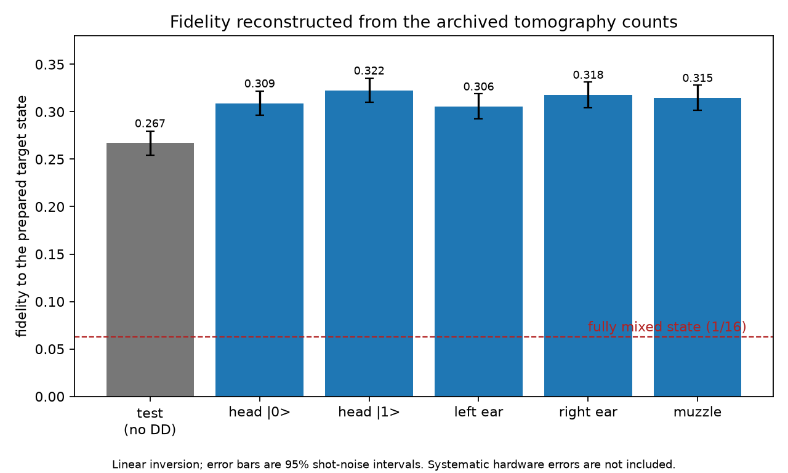
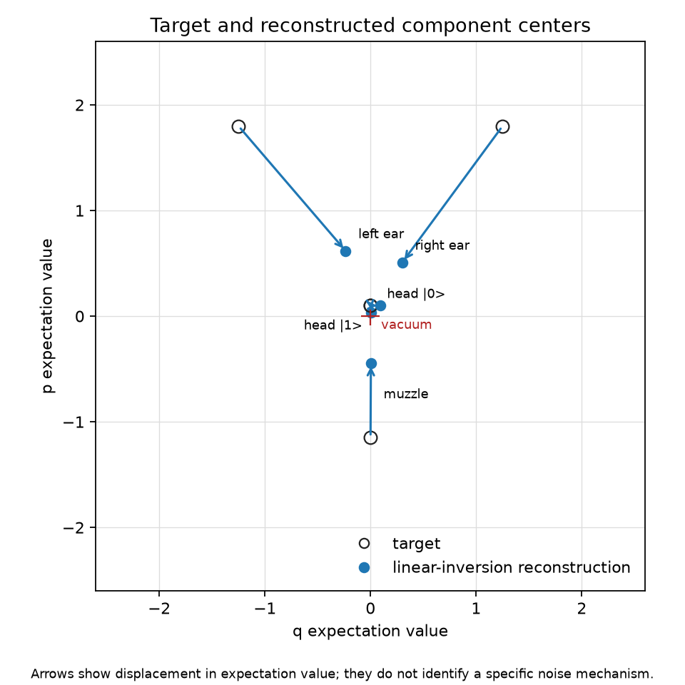

# Archived IBM run

This directory contains the data used for the `ibm_kingston` figure. IBM job
pages are visible only to the account that submitted them, so the counts and
representative transpiled circuits are stored here.

| Path | Contents |
|---|---|
| `jobs.json` | Job IDs, timestamps, billed time, runtime options, measured qubits and representative circuit statistics |
| `counts/` | Counts for every tomography basis; `m_idx` uses 0=Z, 1=X and 2=Y |
| `circuits/` | OpenQASM 3 for basis 0 of each job; the remaining circuits differ in tomography-basis rotations |
| `calibration_ibm_kingston.json` | Calibration returned for the run time |
| `requirements-lock.txt` | Environment captured after submission |
| `states/` | Linear-inversion reconstructions generated by `refit.py` |
| `fetch.py` | Re-downloads the archive from the submitting IBM account |
| `refit.py` | Reconstructs density matrices from the committed counts |
| `rebuild_husky.py` | Rebuilds the hardware image from those matrices |
| `plots.py` | Regenerates the two diagnostic figures |

Run from the repository root:

```sh
ibm/.venv/bin/python run/refit.py
ibm/.venv/bin/python run/rebuild_husky.py
ibm/.venv/bin/python run/plots.py
```

The refit currently reports:

```text
job                    label                            fidelity  purity
d98ra8af47jc73a896ng   single-component test (muzzle)      0.267   0.163
d98rg3if47jc73a89ct0   component 1: head |0>               0.309   0.169
d98rgcgtcv6s73dmgbhg   component 2: head |1>               0.322   0.171
d98rglgtcv6s73dmgbsg   component 3: left ear               0.306   0.165
d98rgugtcv6s73dmgc60   component 4: right ear              0.318   0.162
d98rh74qp3as739tajjg   component 5: muzzle                 0.315   0.164
```

`refit.py` uses linear inversion, so its density matrices can have small negative
eigenvalues. The live Qiskit analysis projected its fit onto the positive
semidefinite cone. That accounts for the small difference between the archived
linear-inversion values and the live values.

The dashed line in `fidelity.png` is computed from the archived error assigned to
every SX, X, CZ and measurement operation in each representative QASM circuit.
It is an independent-error baseline, not a hardware simulator: it omits gate
duration, idle-time decoherence, crosstalk and drift.

The no-DD test and DD render muzzle differ by about 0.05 fidelity. They were not
run as a randomized controlled comparison, so that difference should not be
generalized into a dynamical-decoupling benchmark.

## Reconstructed fidelity

<p align="center"></p>

The bars are computed directly from the committed counts with linear inversion.
The error bars propagate multinomial shot noise through that same calculation
and show approximate 95% intervals. They do not include calibration drift,
crosstalk, state-preparation error or other systematic effects.

## Component centers in phase space

<p align="center"></p>

Open markers are the target expectation values and filled markers are the values
from the reconstructed density matrices. The arrows describe the measured shift;
they do not by themselves establish amplitude damping or any other single noise
mechanism.
